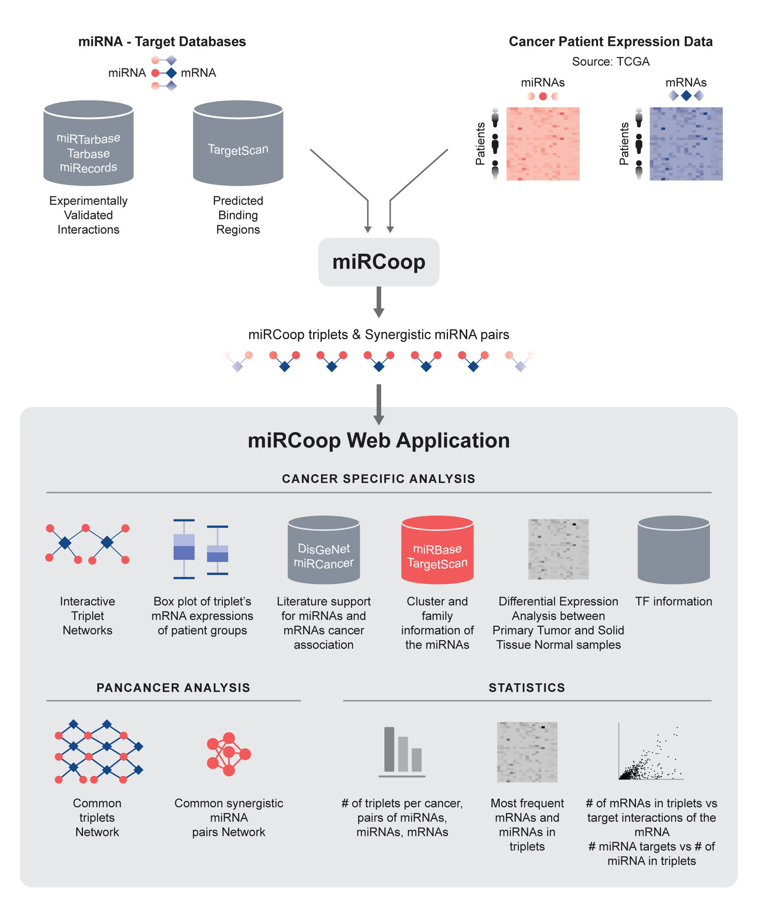

miRCoop v2
===================================

`miRCoop <https://ieeexplore.ieee.org/document/9311836>`_, is a method that finds potentially synergistic pairs through kernel interaction tests on matched gene expression levels of mRNAs and miRNAs. Now, we present an updated miRCoop pipeline, miRCoop v2, a faster version with a 30 speed up in runtime, which allowed us to apply it on 31 different TCGA cancers. The candidate cancer triplets, the synergistic miRNA pairs and their common targets,  are presented in `miRCoop web application <http://mircoop.sabanciuniv.edu>`_ to make our results available to the public. 

  
  Figure 1. General Outline for miRCoop and miRCoop Web Application 

.. note::

  Related links
  
  * `miRCoop web application <http://mircoop.sabanciuniv.edu>`_
  * `miRCoop Paper <https://ieeexplore.ieee.org/document/9311836>`_
  * miRCoop v2 Paper
  * `Docker Image <https://hub.docker.com/repository/docker/oykuaslan/mircoop-webapp>`_
  * `Github Repository <https://github.com/oykuaslan/miRCoopWebApp>`_

.. note::

   This project is under active development.

Contents
--------

.. toctree::
   :maxdepth: 1
   :caption: Methods & Dataset
    
   methods_dataset/dataset
   methods_dataset/methods

.. toctree::
   :maxdepth: 1
   :caption: miRCoop Web Application
   
   webapp/intro
   webapp/cancer_spec_analys
   webapp/pan_cancer_analys
   webapp/stats

   
.. toctree::
   :maxdepth: 1
   :caption: Appendix
   
   appendix/TCGA_projects
   appendix/glossary
   appendix/references
