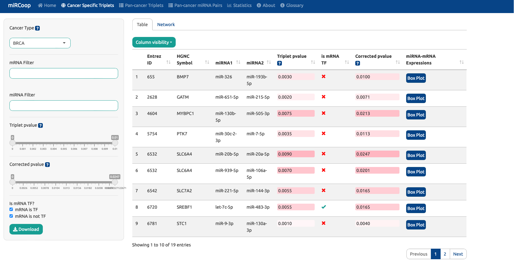
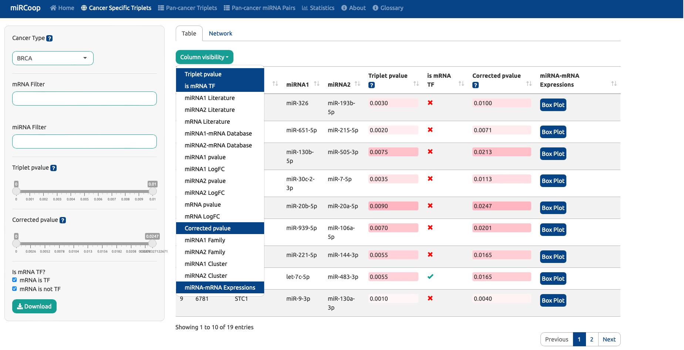
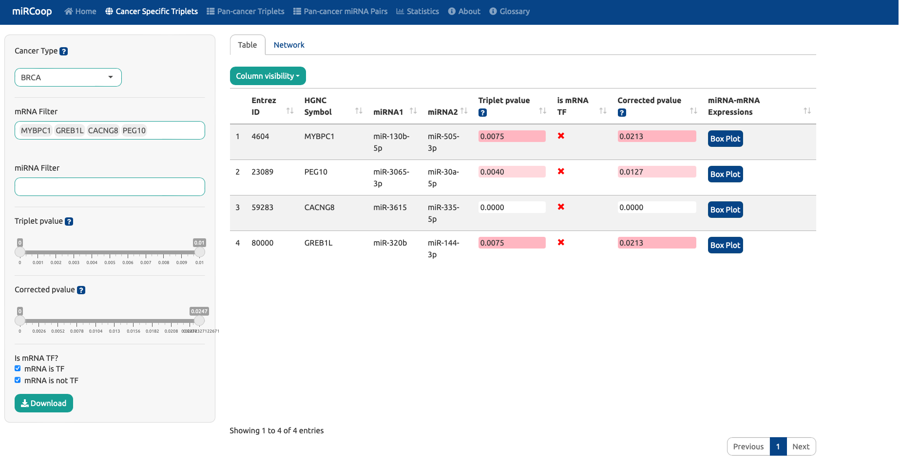
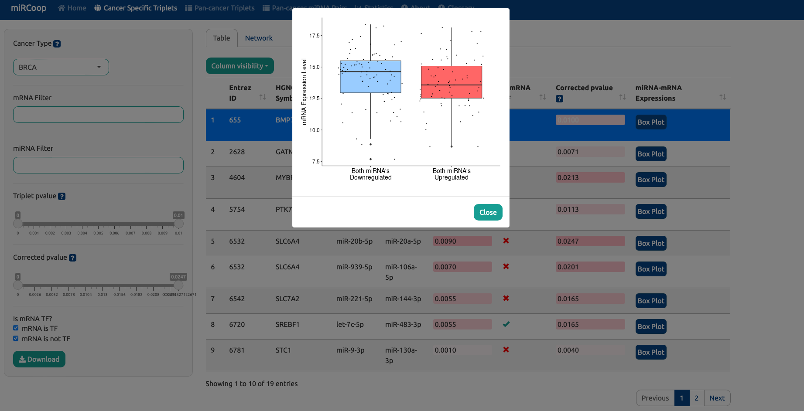
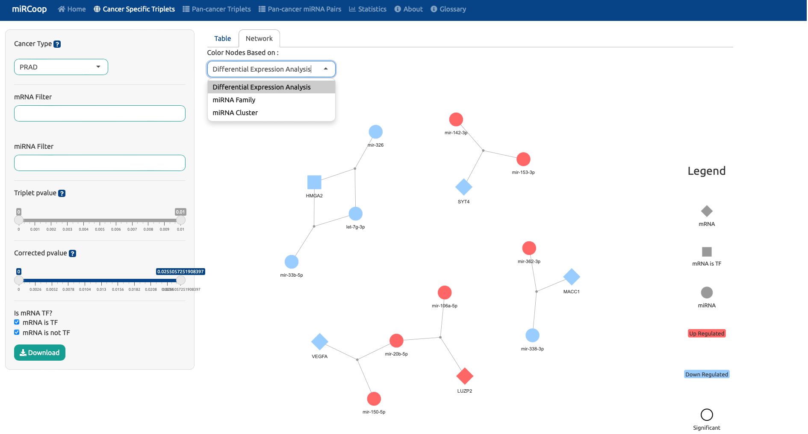
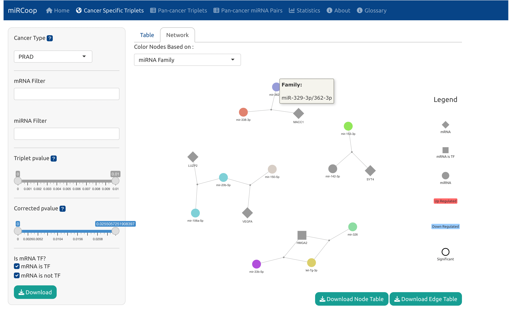

Cancer Specific Analysis
========
Users can investigate predicted triplets here. First, users can select a cancer type from 31 different TCGA cancer types included in the study from the cancer type section. After the 'cancer type' is selected in the left panel, the miRCoop triplets and synergistic miRNA pairs identified for that cancer are presented to the user in the main panel.

  Figure 1. Main panel for triplets. Here BRCA is selected as the cancer type.
  
The datatable in the main panel initially builds on the identified triplets, miRNA pairs and their target mRNA, triplet p-values and corrected p-values with the Benjamini Hochberg procedure. The data has been enriched with the following additional information: experimental data source of miRNA and mRNA relationships, differential expression analysis results, literature support of cancer-miRNA and cancer-mRNA relationship, mRNA expressions of patients grouped by miRNA expression levels and transcription factor information. This additional information can be added/deattached to datatable from 'Column visibility' part. 

  
  Figure 2. Additional information can be added to the main datatable from Column Visibility part.
  
Users have various options to filter the results in this section. Users can filter the identified triplets with their respective triplet p-value, corrected triplet p-value. Also users can filter by whether the mRNA in triplets targeted by the miRNA pair is a transcription factor.

  
  Figure 3. Triplets in BRCA are filtered with mRNA. 

One of the filtering applied in algorithm step 2 was to group patients according to the expression level of the miRNA pair, measuring the difference as log fold change, and continuing with those above a certain threshold. Here, the two patient groups are compared by the level of miRNA pair. We expect the mRNA levels of these two groups(both miRNAs upregulated - both miRNAs downregulated) to be significantly different from each other. The difference between these groups can be observed with a boxplot from 'miRNA-mRNA Expressions' column. 

  
  Figure 4. Example boxplot of mRNA expression level grouped by miRNA expression level. 
  
Triplet networks can be visualised interactively for a specific cancer. In networks, diamonds are mRNAs, circles are miRNAs of the triplets. The small grey nodes are dummy nodes to connect the miRNAs to the target mRNA. If an mRNA in a triplet is also a TF, its shape alters from diamond to square. Coloring the nodes can be done in three different ways: based on differential expression analysis(based on up or down regulation), based on miRNA Family information or based on miRNA Cluster information. When the user applies filtering to the data, the network is reconstructed accordingly.

  
  Figure 4. Interactive triplet network for PRAD. Network coloring option selected as differential expression analysis. 
  
When the user colors the networks according to family or cluster information, if s/he wants to see which family/cluster the miRNA node belongs to, it is sufficient to hover the mouse over the node. Family information will be displayed in coloring with family, cluster information will be displayed in coloring with cluster.

  
  Figure 4. Family/Cluster information of the miRNA can be seen when hovered to node. 
  

