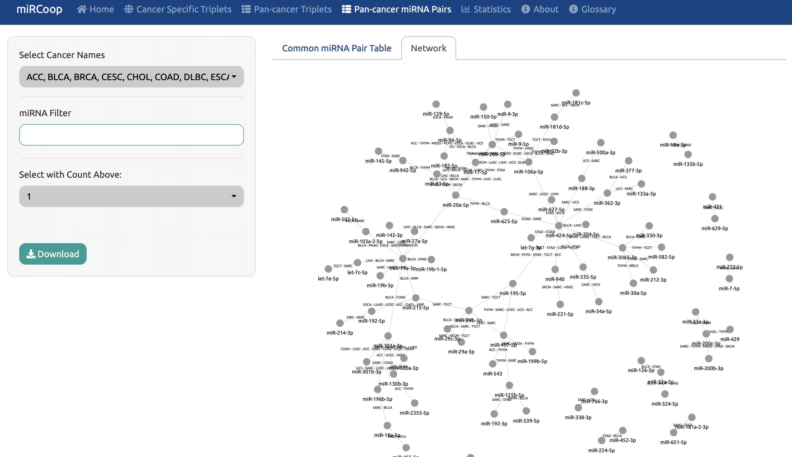

Pan-cancer Anaysis
========
Users can view pan-cancer miRNA pairs and pan-cancer miRCoop triplets via selecting the respective sections. 

  
  Figure 1. Main panel for Pan-cancer Triplets. 
  
.. figure:: ../../figures/pan_cancer/2.png
  :width: 700
  :alt: Alternative text
  
  Figure 2. Main panel for Pan-cancer synergistic miRNA pairs. 
  
Various filtering options provided to users: Users can filter pan-cancer triplets and synergistic pairs based on cancer type, number of cancer count, miRNA and mRNA from the left side panel. 

  Figure 3. Main panel for Pan-cancer synergistic miRNA pairs. Filtering is applied with miRNAs and pairs that are common in more than 3 cancers.  

Here, users can generate interactive networks of pan-cancer miRNA pairs and triplets with network tab like in the Cancer Specific Triplets section. When user applies filtering from the left panel, the network reconstructed accordingly.

  
  Figure 4. Interactive network for pan-cancer synergistic miRNA pairs.
