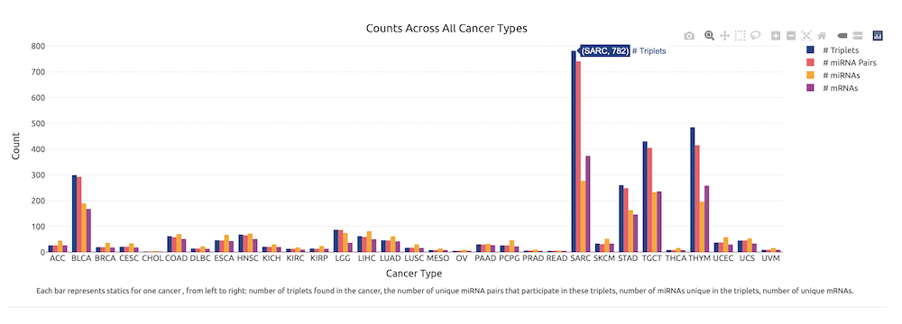
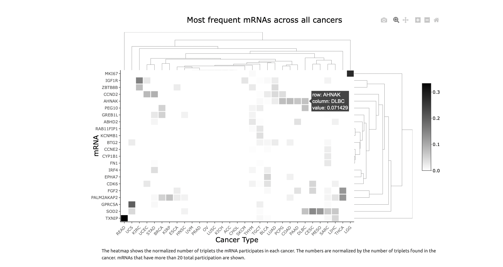
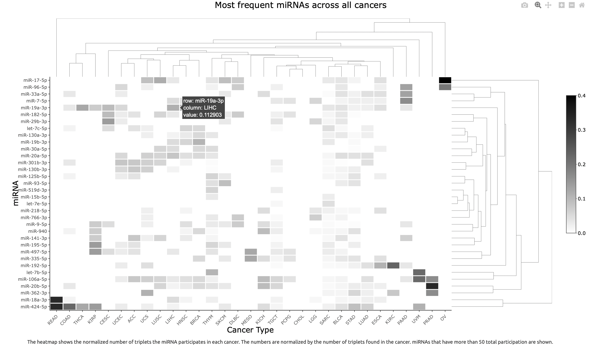
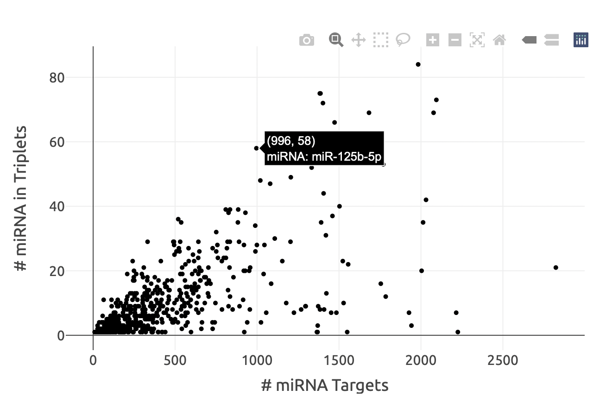
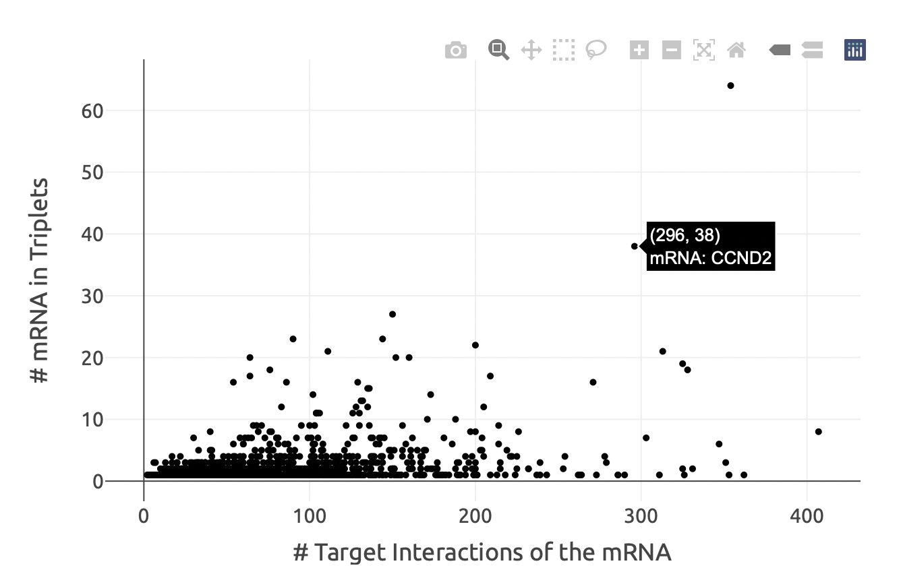

Statistics
========
Users can view some statistics regarding the dataset and results. Counts across all cancer types (number of triplets in each cancer, the number of unique miRNA pairs that participate in these triplets, number of unique miRNAs in the triplets, number of unique mRNAs) is shown with bar graph. When user hovers the mouse, s/he can see the numbers explicitly.

  Figure 1. Total counts for all cancer types. 

The distribution of miRNAs and mRNAs, which have a higher overall frequency than others was examined in order to analyse whether these miRNAs and mRNAs are seen in a specific cancer or are distributed in multiple different cancer types. miRNAs and mRNAs that have total participation more than 30 and 15 in all miRCoop triplets are shown in figures respectively. Values are normalised with the total number of triplets in the cancer. When user hovers the mouse to the desired cell, s/he can see the miRNA/mRNA, cancer type and it's respective value explicitly.

  Figure 2. Most frequent mRNAs across all cancers
  

  Figure 3. Most frequent miRNAs across all cancer

The number of miRNA targets vs the number miRNA existence in triplets are represented to the users. Users can clearly see the information when they hovers to the points. To illustrate, the miRNA miR-125-5p has 996 targets and it is seen in 58 triplets.

  Figure 4. The number of miRNAs that target the mRNA plotted against the number of triplets the miRNA is found in. 
  
The number of mRNAs in triplets in all cancers and the number of mRNA-target interactions are also presented to the users. Users can clearly see the information when they hovers to the points. To illustrate, the mRNA CCND2 has 296 target interactions and it is seen in 38 triplets.

  Figure 5. The number of mRNAs the miRNA targets plotted against the number of triplets the mRNA is found in. 
  
